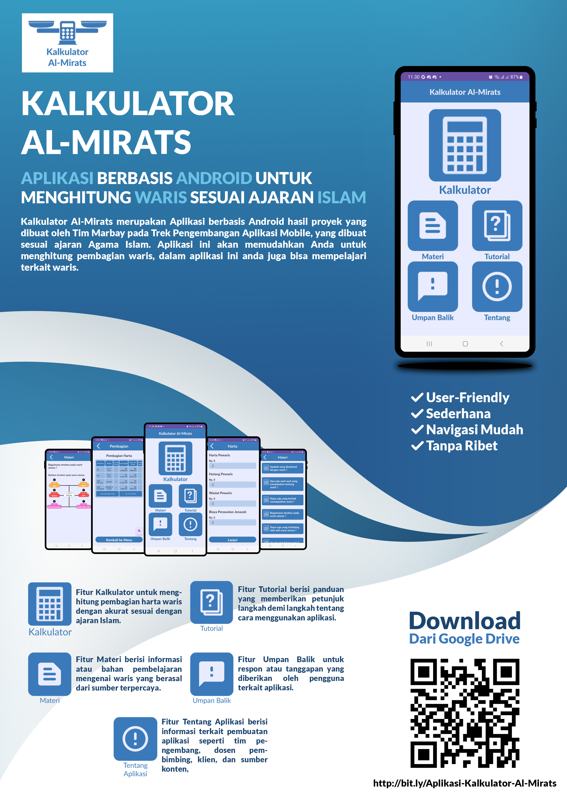

# Kalkulator Al-Mirats

Kalkulator Al-Mirats adalah aplikasi berbasis Android yang dirancang untuk mempermudah perhitungan pembagian harta waris sesuai dengan syariat Agama Islam (Ilmu Faraid). Aplikasi ini menyederhanakan perhitungan waris yang kompleks menjadi mudah, cepat, dan akurat, serta dilengkapi dengan materi edukasi pendukung.

Aplikasi ini dikembangkan oleh **Tim Marbay** pada **Trek Pengembangan Aplikasi Mobile**.

---

## Poster Aplikasi
Berikut adalah poster informasi dan tampilan antarmuka dari aplikasi Kalkulator Al-Mirats:

<!-- Silakan simpan gambar poster Anda di folder utama projek ini dengan nama 'poster.png' -->

---

## Fitur Utama

Aplikasi ini dilengkapi dengan 5 fitur utama yang dirancang agar *user-friendly*, sederhana, dan memiliki navigasi yang mudah:

1. 🧮 **Kalkulator Al-Mirats (Faraid)**
   Menghitung pembagian harta waris secara akurat. Mendukung pengurangan harta otomatis untuk pengurusan kewajiban pewaris (seperti hutang, wasiat, dan biaya perawatan jenazah) sebelum pembagian dilakukan.
   
2. 📚 **Materi Edukasi**
   Menyediakan bahan pembelajaran komprehensif mengenai konsep dan hukum waris Islam yang bersumber dari rujukan terpercaya.

3. ❓ **Tutorial Penggunaan**
   Panduan langkah demi langkah yang memberikan petunjuk interaktif mengenai cara menggunakan aplikasi agar pengguna tidak kebingungan.

4. 💬 **Umpan Balik (Feedback)**
   Fasilitas bagi pengguna untuk mengirimkan saran, kritik, atau penilaian terkait aplikasi demi pengembangan lebih lanjut secara *real-time*.

5. ℹ️ **Tentang Aplikasi**
   Informasi detail mengenai pengembang aplikasi (Tim Marbay), dosen pembimbing, klien, serta sumber konten yang digunakan.

---

## Logika & Algoritma Faraid yang Diimplementasikan
Aplikasi ini berhasil mengotomatisasi aturan fikih kewarisan Islam yang kompleks, di antaranya:
- **Ashobah & Ashobah bil-Ghair:** Perhitungan sisa harta waris dengan rasio pembagian laki-laki dan perempuan ($2:1$).
- **Radd:** Pengembalian sisa harta waris kepada ahli waris dzul-faradh jika tidak ada ahli waris sisa (*ashobah*).
- **Aul:** Penyesuaian proporsional pecahan ketika total bagian ahli waris melebihi jumlah harta yang tersedia.

---

## Spesifikasi Teknis (Tech Stack)
- **Bahasa Pemrograman:** Kotlin (Android Native)
- **Database Lokal:** Room Database (untuk menyimpan *state* input terakhir pengguna agar tidak hilang saat aplikasi ditutup)
- **Database Cloud:** Firebase Firestore (untuk menampung data umpan balik pengguna)
- **User Interface:** XML Layouts, ViewBinding, Material Design Components
- **Library Tambahan:** `com.uncopt:android.justified` untuk perataan teks materi yang rapi

---

## Unduh Aplikasi
Aplikasi ini dapat diunduh langsung melalui Google Drive pada tautan berikut:
👉 [Download Aplikasi Kalkulator Al-Mirats](http://bit.ly/Aplikasi-Kalkulator-Al-Mirats)
